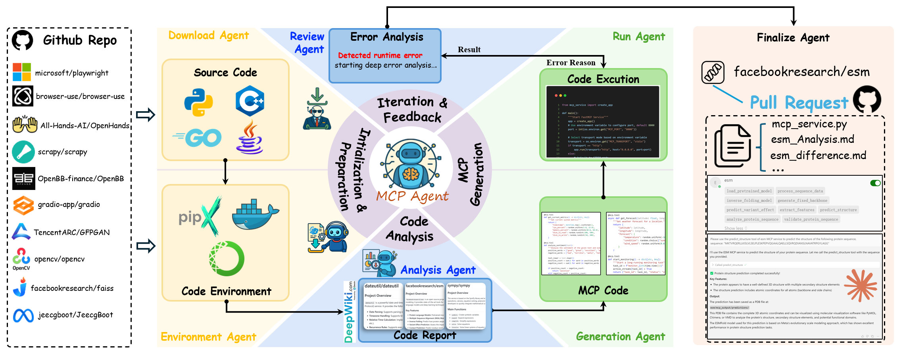

# Code2MCP

## Project Overview



Code2MCP is an automated workflow system that transforms existing code repositories into MCP (Model Context Protocol) services. The system follows a minimal intrusion principle, preserving the original repository's core code while only adding service-related files and tests.

## Core Features

1. **Intelligent Code Analysis**
   - LLM-powered deep code structure analysis
   - Automatic identification of core modules, functions, and classes
   - Smart generation of MCP service code

2. **MCP Service Generation**
   - Automatic generation of `mcp_service.py`, `adapter.py`, and other core files
   - Support for multiple project structures (src/, source/, root directory, etc.)
   - Intelligent handling of import paths and dependency relationships

3. **Workflow Automation**
   - Complete 7-node workflow: download → analysis → env → generate → run → review → finalize
   - Automatic environment configuration and test validation
   - Comprehensive logging and status tracking
   - Intelligent error recovery and retry mechanisms

## Quick Start

### 1. Environment Setup

Copy the environment variables template:
```bash
cp env_example.txt .env
```
Edit the `.env` file to configure necessary environment variables.

### 2. Install Dependencies

```bash
pip install -r requirements.txt
```

### 3. Run Workflow

```bash
# Basic usage
python main.py https://github.com/username/repo

# Specify output directory
python main.py https://github.com/username/repo --output ./my_output
```

## Workflow Process

1. **Download Node**: Clone repository to `workspace/{repo_name}/`
2. **Analysis Node**: LLM deep analysis of code structure and functionality
3. **Env Node**: Create isolated environment and validate original project
4. **Generate Node**: Intelligently generate MCP service code
5. **Run Node**: Execute service and perform functional validation
6. **Review Node**: Code quality review, error analysis, and automatic fixes
7. **Finalize Node**: Compile results and generate comprehensive report

## Output Structure

Complete structure for each converted project:

```text
workspace/
└── {repo_name}/
    ├── .git/                    # Original repository history
    ├── source/                  # Original project source code (unchanged)
    ├── mcp_output/              # Generated MCP service files
    │   ├── start_mcp.py         # MCP service startup entry
    │   ├── mcp_plugin/
    │   │   ├── __init__.py      # Plugin package initialization
    │   │   ├── main.py          # Plugin main entry
    │   │   ├── mcp_service.py   # Core MCP service implementation
    │   │   └── adapter.py       # Adapter implementation
    │   ├── tests_mcp/
    │   │   └── test_mcp_basic.py # Basic test files
    │   ├── requirements.txt      # Dependency package list
    │   ├── README_MCP.md        # Service documentation
    │   ├── analysis.json        # Repository analysis results
    │   ├── env_info.json        # Environment configuration info
    │   ├── code_review_results.json # Code review results
    │   ├── diff_report.md       # Difference report (Markdown)
    │   ├── workflow_summary.json # Workflow summary
    │   └── mcp_logs/            # Runtime logs directory
    │       ├── run_log.json     # Runtime logs
    │       └── llm_statistics.json # LLM call statistics
    └── logs/                    # Workflow execution logs
```

## Successfully Converted Project Examples

- **UFL**: Finite element symbolic language → MCP finite element analysis
- **dalle-mini**: Higher-quality, controllable text-to-image → MCP image generation
- **ESM**: Protein structure/variant scoring (real artifacts) → MCP protein analysis
- **deep-searcher**: Query rewrite, multi-hop, credible sources → MCP search
- **TextBlob**: Deterministic tokenize/POS/sentiment → MCP NLP preprocessing
- **dateutil**: Correct timezones/rrule edge cases → MCP time utilities
- **sympy**: Exact symbolic math/solve/codegen → MCP math reasoning

## Key Features

- **Smart Import Handling**: Automatic identification of correct module import paths
- **Professional Documentation**: Automatic generation of English README and comments
- **Comprehensive Test Coverage**: Includes basic functionality tests and health checks
- **Detailed Report Generation**: Provides complete conversion process reports
- **Intelligent Dependency Management**: Automatic handling of complex Python package dependencies

## Usage Example

```bash
python main.py https://github.com/username/repo
```

-----

## Citation

If you use Code2MCP in your research, please cite our paper:

```bibtex
@article{ouyang2025code2mcp,
  title={Code2MCP: A Multi-Agent Framework for Automated Transformation of Code Repositories into Model Context Protocol Services},
  author={Ouyang, Chaoqian and Yue, Ling and Di, Shimin and Zheng, Libin and Pan, Shaowu and Zhang, Min-Ling},
  journal={arXiv preprint arXiv:2509.05941},
  year={2025}
}
```


